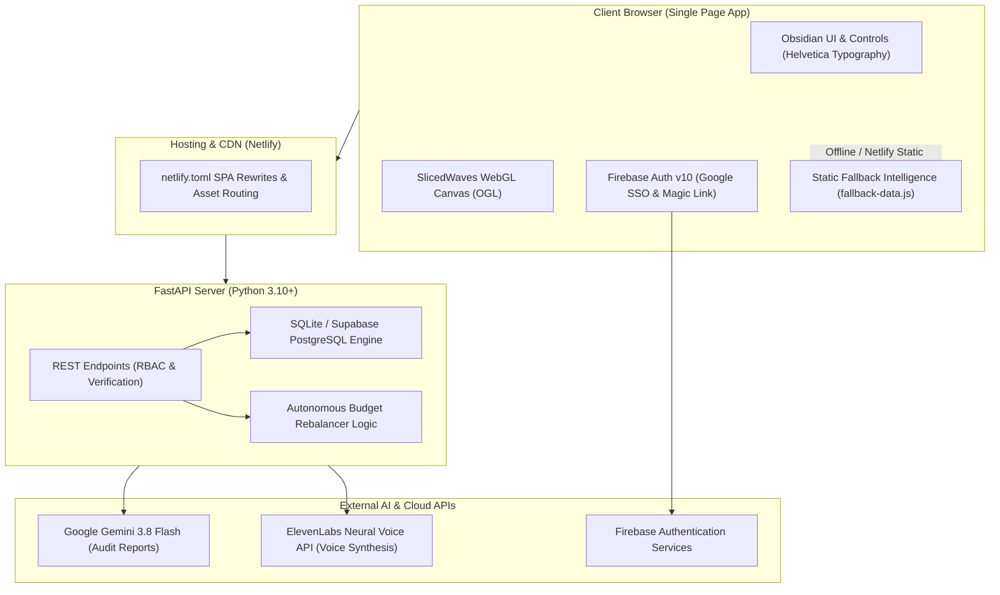

# Adventory AI

> **Autonomous Advertising & Inventory Intelligence Engine for D2C Brands**

[](https://fastapi.tiangolo.com)
[](https://python.org)
[](https://firebase.google.com)
[](https://groq.com)
[](https://ai.google.dev/)
[](https://elevenlabs.io/)
[](https://netlify.com)

---

## 📌 Executive Summary

Modern Direct-to-Consumer (D2C) brands bleed millions annually because **advertising platforms run blind to real-time warehouse inventory**. Marketing teams continue spending aggressive budgets promoting SKUs that are completely out of stock or critically backlogged, while high-margin, overstocked products languish with zero ad spend.

**Adventory AI** permanently closes this loop. By ingesting live stock levels, unit economics, and multi-channel ad attribution in real time, Adventory acts as an autonomous operating engine that:
1. **Instantly terminates wasted ad spend** on sold-out products.
2. **Autonomously rebalances daily budgets** towards high-margin, high-stock scalers.
3. **Audits attribution performance** using Media Rating Council (MRC) viewability standards.
4. **Synthesizes executive audio briefings and tax invoices** on demand.

---

## 🚀 Key Features

### 1. 🛡️ Autonomous Anomaly Detection & Wasted Ad Killer
- Continuously cross-references stock counts against ad spend across **Meta Ads, Google Ads, Amazon Ads, and TikTok Ads**.
- Immediately flags active campaigns spending money on items marked `OUT_OF_STOCK` or `ABOUT_TO_SOLD_OUT`.
- Displays real-time burn metrics (e.g. `₹9,500/day | ₹2,85,000/month wasted`) with a single-click **"Pause Wasted Ads Now"** action.

### 2. 🔐 Institutional Domain & Role-Based Access Control (RBAC)
- Enterprise authentication backed by **Firebase Auth v10**:
  - **Google Institutional SSO**: Automatic popup login with redirect fallback.
  - **Passwordless Magic Links**: Direct, prompt-free email sign-in tokens.
- **Strict Role Isolation**:
  - Restricted strictly to verified `@vitstudent.ac.in` domains.
  - **Shailja Singh** &rarr; Dedicated access to the **Footwear Sector** (`FW-*` SKUs).
  - **Sandru S** &rarr; Dedicated access to the **Apparel Sector** (`AP-*` SKUs).
  - Zero cross-tenant data leakage: API queries and client state strictly isolated by assigned sector.

### 3. 📊 Real-Time Sector Intelligence & Unit Economics
- Computes comprehensive blended financial and ad metrics:
  - **Financials**: Daily Ad Spend, Attributed Revenue, Net Profit, ROAS.
  - **Impressions & Quality**: Served Impressions, Viewable Impressions, MRC Viewability Rate (benchmark: 70%+).
  - **Engagement & Conversion**: Reach, Frequency, Total Clicks, CTR, CPC, Total Conversions, CVR, CPM.
- Interactive multi-channel campaign table with manual and autonomous status controls.

### 4. ⚖️ Autonomous Budget Rebalancer
- Proprietary algorithmic pipeline analyzing inventory velocity and ROAS performance.
- Automatically calculates recommendations to pause negative/sub-par campaigns and reallocate liberated spend directly into top-performing scalers with abundant stock.
- Interactive recommendation inspection and one-click execution modal.

### 5. 📈 6-Month Touch-to-Order Historical Attribution
- Tracks customer touchpoints across the full 6-month buying journey.
- Interactive **Chart.js** data visualizations displaying:
  - Monthly Spend vs. Revenue curves with gradient fills.
  - Impression viewability and volume bar progressions.
  - 6-month revenue and conversion growth percentage benchmarks.

### 6. 🔍 Deep Product Inspection Modal
- Click on any SKU to launch deep forensic analysis:
  - **Tactical AI Verdict**: Dynamic status badge (`KILL / SCALE / OPTIMIZE`) with algorithmic justification.
  - **Unit Economics**: Unit stock, landed cost, retail price, and gross margin percentage.
  - **Touch-to-Order Funnel**: Stage-by-stage drop-off tracking (Served Impressions &rarr; Viewable Impressions &rarr; Clicks &rarr; Add to Cart &rarr; Orders).
  - **Channel Breakdown**: Detailed ROAS and conversion metrics across Meta, Google, Amazon, and TikTok.
  - **Continuous Performance Curves**: Multi-timeframe trendlines (Monthly, Weekly, Daily).

### 7. 🎙️ AI Executive Diagnosis & Neural Voice Narration
- **Autonomous Audit Diagnosis & Chat**: Powered by **Groq Cloud LLM** (Qwen / Llama) with high-speed inference and **Google Gemini 3.8 Flash** fallback, analyzing cross-platform anomalies, ROAS, and inventory health.
- **Voice Briefing**: Powered by **ElevenLabs Neural Voice API** (`JBFqnCBsd6RMkjVDRZzb` persona) with real-time waveform visualizer and browser SpeechSynthesis fallback.
- **Saved Briefings Log**: Historical archive of generated audits with timestamps and profit snapshots.

### 8. 🧾 Enterprise Quotation & Tax Billing Engine
- One-click generation of printable **Enterprise Invoices / Quotation Bills**.
- Dynamic calculation of daily ad expenditure, 18% GST tax, total daily investment, and 30-day projected net profit.
- Clean printable CSS format designed for corporate finance and audit review.

### 9. 🌐 React Bits Interactive <CursorGrid /> Background
- Powered by the open-source **React Bits `<CursorGrid />`** component engine.
- Interactive canvas 2D lattice lighting up cells around the cursor with smooth falloff (`color: #6a7d77`, `cellSize: 70px`, `radius: 140px`) and emitting click pulse expanding wave dynamics (`pulseSpeed: 450px/s`).
- Dark minimalist aesthetic perfectly harmonized with the Obsidian and Emerald enterprise theme.

### 10. ⚡ Dual-Mode Deployment Architecture
- **Full-Stack Mode**: Python FastAPI backend + SQLite / Supabase PostgreSQL database + static assets.
- **Serverless / Netlify Static Mode**: Bundled with client-side institutional clearance and embedded fallback dataset (`static/fallback-data.js`), allowing the application to run seamlessly as a standalone static SPA on Netlify without backend downtime.

---

## 🏗️ System Architecture



---

## 💻 Tech Stack

| Layer | Technologies |
|---|---|
| **Frontend Core** | HTML5, CSS3, JavaScript (ES2022+), Chart.js |
| **Shader & Graphics** | WebGL 2.0, GLSL ES 3.0, OGL (`slicedwaves.bundle.js`) |
| **Authentication** | Firebase Web SDK v10 (Google OAuth 2.0, Passwordless Email Link) |
| **Backend API** | FastAPI, Uvicorn (ASGI), Pydantic v2 |
| **Data & ORM** | SQLAlchemy, SQLite 3, Supabase PostgreSQL |
| **Artificial Intelligence** | Google Gemini 3.8 Flash API |
| **Voice Synthesis** | ElevenLabs Text-to-Speech API + Web Speech API fallback |
| **Hosting & CI/CD** | Netlify, GitHub Actions |

---

## 📂 Project Directory Structure

```
adventory/
├── main.py                     # FastAPI backend application & API routes
├── database.py                 # SQLAlchemy models, SQLite/Supabase connectors & schema
├── models.py                   # Pydantic data schemas & verification models
├── seed_data.py                # Database population script for inventory & campaigns
├── netlify.toml                # Netlify deployment rules, SPA redirects & asset routing
├── requirements.txt            # Python dependencies
├── package.json                # Frontend package configuration (Firebase, OGL)
├── .env.example                # Template for environment credentials
│
├── static/                     # Static client files served by Netlify & FastAPI
│   ├── index.html              # Core single-page application dashboard & styles
│   ├── fallback-data.js        # Offline & serverless fallback intelligence dataset
│   ├── firebase-config.js      # Firebase Web SDK initialization config
│   ├── slicedwaves.bundle.js   # Compiled WebGL shader canvas bundle
│   ├── ogl.umd.min.js          # Minimal WebGL library
│   ├── adventory_logo.png      # High-resolution brand logo
│   ├── favicon.png             # Application favicon
│   └── hero.png                # Hero preview graphic
│
└── scratch/                    # Development scripts and generated datasets
```

---

## ⚙️ Quick Start & Local Setup

### Prerequisites
- **Python 3.10+**
- **Node.js 18+** (optional, for asset bundling)
- **Git**

### 1. Clone the Repository
```bash
git clone https://github.com/Sophie-eve/adventory.git
cd adventory
```

### 2. Configure Environment Variables
Copy the example environment file and provide your API keys:
```bash
cp .env.example .env
```
Edit `.env` with your credentials:
```env
# Optional Supabase Database (defaults automatically to local SQLite d2c_engine.db)
DATABASE_URL=sqlite:///./d2c_engine.db

# Groq Cloud API Configuration (for High-Speed Autonomous AI Reasoning)
GROQ_API_KEY=your-groq-api-key
GROQ_MODEL=qwen/qwen3.8-27b

# Google Gemini API Key (for Fallback Autonomous AI Diagnostics)
GEMINI_API_KEY=your-gemini-api-key

# ElevenLabs Configuration (for Neural Audio Narration)
ELEVENLABS_API_KEY=your-elevenlabs-api-key
ELEVENLABS_VOICE_ID=JBFqnCBsd6RMkjVDRZzb
```

### 3. Install Python Dependencies
```bash
pip install -r requirements.txt
```

### 4. Start the Application
Run the FastAPI development server:
```bash
python -m uvicorn main:app --host 127.0.0.1 --port 8000 --reload
```
Open your browser and navigate to:
```
http://127.0.0.1:8000
```

---

## 👥 Role-Based Access Credentials

Adventory strictly enforces institutional access for authorized analysts:

| Analyst | Institutional Identifier | Assigned Sector | Accessible Inventory |
|---|---|---|---|
| **Shailja Singh** | `shailja@vitstudent.ac.in`<br> | **Footwear** | 14 Footwear SKUs (`FW-1002` to `FW-1015`) |
| **Sandru S** | `sandru@vitstudent.ac.in`<br> | **Apparel** | 15 Apparel SKUs (`AP-2001` to `AP-2015`) |

> ⚠️ **Access Guard**: Any non-institutional email (e.g., standard `@gmail.com`) or unauthorized VIT student account will be rejected with an `Unauthorized user` alert.

---

## 🌐 Netlify Deployment

This project is configured out of the box for continuous deployment on **Netlify**:
1. Connect repository `https://github.com/Sophie-eve/adventory.git` in Netlify.
2. Build Settings:
   - **Build command**: *(leave empty)*
   - **Publish directory**: `static`
3. [`netlify.toml`](./netlify.toml) automatically configures:
   - Static asset forwarding: `/static/*` &rarr; `/:splat` (status 200).
   - Single Page Application routing: `/*` &rarr; `/index.html` (status 200).
4. Add your Netlify domain (e.g. `your-app.netlify.app`) to:
   - **Firebase Console** &rarr; **Authentication** &rarr; **Settings** &rarr; **Authorized domains**.

---

## 📄 License & Attribution

Developed by **Kushaanth M**, **Sandru S**, **Varun S**, and **Shailja Singh**  
Vellore Institute of Technology (VIT).  
All rights reserved &copy; 2026 Adventory AI.
